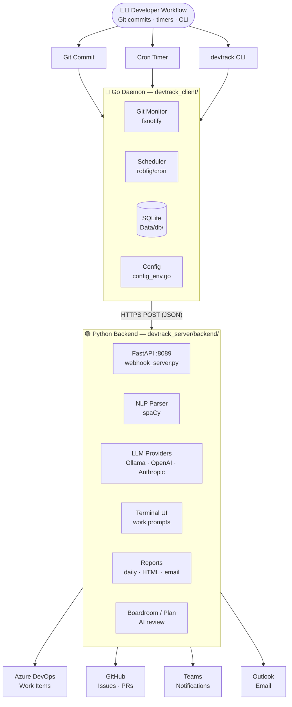
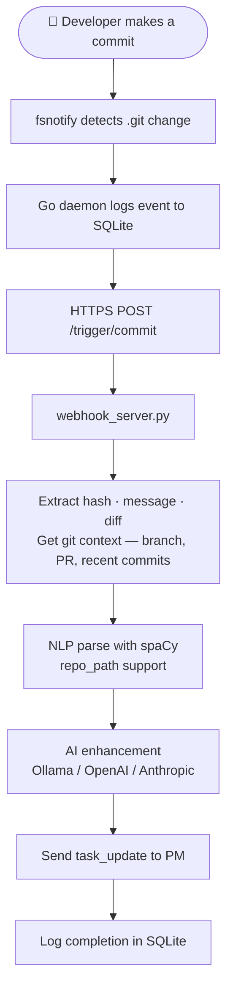
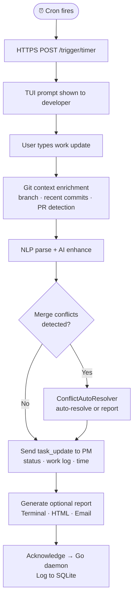
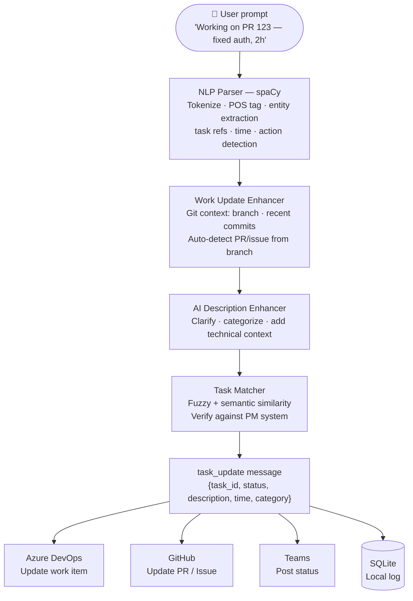
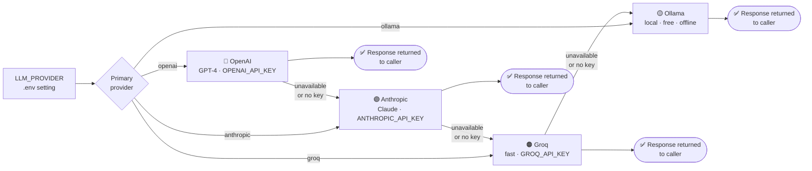

# DevTrack System Architecture

Complete overview of DevTrack's system design, components, and data flow.

---

## High-Level Architecture



---

## Component Breakdown

### 1. Go Daemon Layer (devtrack_client/)

The lightweight background service that monitors and coordinates.

#### Key Components

| Component | File | Purpose |
|-----------|------|---------|
| **Entry Point** | main.go | Routes CLI args or delegates git subcommand |
| **CLI Handler** | cli.go | Implements all CLI commands (start, stop, status, etc.) |
| **Daemon Lifecycle** | daemon.go | Manages PID file, signals, Python bridge process |
| **Integration Hub** | integrated.go | Wires together git monitor, scheduler, IPC server |
| **Git Monitor** | git_monitor.go | fsnotify-based repository watcher, fires commit_trigger |
| **Scheduler** | scheduler.go | Cron-based periodic trigger, fires timer_trigger |
| **IPC Server** | ipc.go | TCP server, JSON message protocol, one handler per MessageType |
| **Database** | database.go | SQLite access, trigger history, task updates |
| **Configuration** | config.go, config_env.go | YAML struct + .env accessors |
| **Learning** | learning.go | AI learning consent and profile management |

#### Message Types

Go daemon and Python bridge communicate using JSON-delimited messages over TCP:

```
commit_trigger    → Git commit detected
timer_trigger     → Scheduled time reached
task_update       → Update project management system
acknowledge       → Confirm message received
error             → Report error back to client
```

#### Data Storage

SQLite database (`Data/db/devtrack.db`) stores:
- Trigger history (commits, timers)
- Task updates sent to external systems
- User preferences and learning profiles
- Error logs and debugging info

---

### 2. Python Intelligence Layer (devtrack_server/backend/)

The smart processing engine that handles AI, NLP, and integrations.

#### Core Infrastructure

| Module | Purpose |
|--------|---------|
| **backend/webhook_server.py** | Primary Python entry point started by Go daemon; FastAPI server handling triggers from Go and inbound webhook events |
| **backend/config.py** | Centralized config; all modules use `get()`, `get_int()`, `get_bool()`, `get_path()` |
| **backend/ipc_client.py** | Legacy TCP IPC client (internal only; new features use HTTP `/trigger/*` endpoints) |

#### NLP & AI Processing

| Module | Purpose |
|--------|---------|
| **backend/nlp_parser.py** | spaCy-based NLP for commit/user text → structured task data |
| **backend/description_enhancer.py** | Ollama-based description enhancement and categorization |
| **backend/llm/provider_factory.py** | Multi-provider LLM abstraction with fallback chain |
| **backend/llm/ollama_provider.py** | Local Ollama integration |
| **backend/llm/openai_provider.py** | OpenAI GPT-4 integration |
| **backend/llm/anthropic_provider.py** | Anthropic Claude integration |
| **backend/personalized_ai.py** | AI learning from user communications |
| **backend/learning_integration.py** | Learning consent and profile handling |

#### User Interaction & Reporting

| Module | Purpose |
|--------|---------|
| **backend/user_prompt.py** | Terminal TUI for interactive work-update prompts |
| **backend/daily_report_generator.py** | AI-enhanced daily/weekly report generation (Terminal, HTML, Markdown, JSON) |
| **backend/email_reporter.py** | Report delivery via email/Teams |
| **backend/task_matcher.py** | Fuzzy + semantic matching of natural language to tracked tasks |

#### Git Integration

| Module | Purpose |
|--------|---------|
| **backend/commit_message_enhancer.py** | AI-powered iterative commit message refinement |
| **backend/git_diff_analyzer.py** | Analyzes staged changes for context |
| **devtrack_client/git_sage/agent.py** | Agentic loop for autonomous git operations |
| **devtrack_client/git_sage/llm.py** | Ollama and OpenAI-compatible LLM backends |
| **devtrack_client/git_sage/context.py** | Git repository state collection |
| **devtrack_client/git_sage/config.py** | ~/.config/git-sage/config.json management |
| **devtrack_client/git_sage/git_operations.py** | Advanced git operations (branches, commits, merges, blame, stash) |
| **devtrack_client/git_sage/conflict_resolver.py** | Intelligent conflict analysis and resolution |
| **devtrack_client/git_sage/pr_finder.py** | PR/MR utilities and analysis |

#### External Integrations

| Module | Purpose |
|--------|---------|
| **backend/jira/client.py** | Jira REST API client |
| **backend/github/pr_analyzer.py** | GitHub PR analysis |
| **backend/azure/client.py** | Azure DevOps work item fetching/updating |
| **backend/msgraph_python/** | Microsoft Graph integration (Teams, Outlook) |

---

### 3. devtrack CLI

The same `devtrack` binary doubles as both the daemon and the CLI.

#### Commands

```
devtrack start           # start the daemon (Git monitor + scheduler)
devtrack stop            # stop the daemon
devtrack status          # show daemon status (PID, uptime, paused state)
devtrack logs [N]        # last N log lines (default 50)
devtrack pause           # pause the scheduler
devtrack resume          # resume the scheduler
devtrack force-trigger   # fire an immediate trigger
devtrack version         # show version
devtrack health          # check server health
devtrack boardroom       # multi-persona AI plan review
devtrack plan            # decompose problem into Epic/Story/Task hierarchy
devtrack setup           # interactive first-run configuration wizard
devtrack uninstall       # remove daemon files and config
```

---

## Data Flow Diagrams

### 1. Commit Trigger Flow



### 2. Timer Trigger Flow



### 3. User Prompt to Task Update Flow



---

## LLM Provider Architecture

DevTrack uses a flexible LLM provider system with automatic fallback chain, configured by `LLM_PROVIDER` in `.env`.



**Benefits**: local Ollama by default (free, offline), transparent cloud fallback when needed, graceful degradation, cost optimization.

---

## Configuration Management

All configuration flows from a single `.env` file with **no hardcoded defaults**.

### How It Works

1. **Go layer** (`devtrack_client/`):
   - Loads `.env` via `joho/godotenv`
   - Exposes variables through `config_env.go` functions
   - All access goes through these functions (not `os.Getenv` directly)

2. **Python layer** (`devtrack_server/backend/`):
   - Loads `.env` via `python-dotenv`
   - Accesses via `backend/config.py` functions
   - All modules use `get()`, `get_int()`, `get_bool()`, `get_path()`
   - No `os.getenv()` calls in business logic

3. **Override mechanism**:
   - `DEVTRACK_ENV_FILE` env var overrides default `.env` location
   - If `DEVTRACK_ENV_FILE` not set, looks for `.env` in working directory
   - If neither found, exits with explicit error message

### Key Environment Variables

| Variable | Layer | Purpose | Example |
|----------|-------|---------|---------|
| `PROJECT_ROOT` | Both | Path to repository | `/home/user/automation_tools` |
| `DEVTRACK_WORKSPACE` | Both | Git repo to monitor | Same as PROJECT_ROOT or custom repo |
| `DATA_DIR` | Both | Runtime data location | `${PROJECT_ROOT}/Data` |
| `IPC_HOST` | Both | IPC server host | `127.0.0.1` |
| `IPC_PORT` | Both | IPC server port | `35893` |
| `LLM_PROVIDER` | Python | Primary AI provider | `ollama` or `openai` or `anthropic` |
| `OLLAMA_URL` | Python | Ollama server URL | `http://localhost:11434` |
| `OPENAI_API_KEY` | Python | OpenAI credentials | (secret) |
| `ANTHROPIC_API_KEY` | Python | Anthropic credentials | (secret) |
| `AZURE_DEVOPS_TOKEN` | Python | Azure DevOps PAT | (secret) |
| `GITHUB_TOKEN` | Python | GitHub personal access token | (secret) |
| `TEAMS_BOT_ID` | Python | Teams bot ID | (secret) |

---

## Database Schema

SQLite database stored at `Data/db/devtrack.db`.

### Tables

#### triggers
```sql
CREATE TABLE triggers (
    id INTEGER PRIMARY KEY,
    type TEXT NOT NULL,           -- 'commit' or 'timer'
    trigger_time DATETIME,        -- When triggered
    git_ref TEXT,                 -- Commit hash or branch
    parsed_data JSON,             -- Extracted task data
    ai_enhanced_data JSON,        -- AI-enhanced version
    status TEXT,                  -- 'pending', 'processing', 'completed', 'error'
    error_message TEXT
);
```

#### task_updates
```sql
CREATE TABLE task_updates (
    id INTEGER PRIMARY KEY,
    task_id TEXT,                 -- e.g., 'PROJ-123'
    system TEXT,                  -- 'azure_devops', 'github', 'jira'
    action TEXT,                  -- 'status_change', 'comment', 'time_tracking'
    payload JSON,                 -- Full update data
    status TEXT,                  -- 'queued', 'sent', 'failed'
    created_at DATETIME,
    sent_at DATETIME
);
```

#### learning_profiles
```sql
CREATE TABLE learning_profiles (
    id INTEGER PRIMARY KEY,
    user_id TEXT,
    communication_style JSON,     -- Learned patterns
    preferred_terms JSON,         -- Favorite phrases
    last_updated DATETIME,
    consent_given BOOLEAN
);
```

---

## IPC Message Protocol

JSON-newline-delimited over TCP socket (default `127.0.0.1:35893`).

### Message Format

```json
{
  "type": "commit_trigger",
  "timestamp": "2026-03-11T10:30:00Z",
  "payload": {
    "commit_hash": "abc123def456",
    "branch": "feature/auth",
    "message": "Fixed OAuth flow",
    "files_changed": 5,
    "insertions": 42,
    "deletions": 12
  }
}
```

Each message must end with a newline (`\n`).

### Message Types

| Type | Direction | Purpose |
|------|-----------|---------|
| `commit_trigger` | Go → Python | Git commit detected |
| `timer_trigger` | Go → Python | Scheduled time reached |
| `task_update` | Python → Go | Update project management system |
| `acknowledge` | Python → Go | Confirm message received |
| `error` | Both | Report error condition |

---

## Technology Stack

### Go Dependencies
- `github.com/robfig/cron/v3` - Cron scheduling
- `github.com/fsnotify/fsnotify` - File system monitoring
- `github.com/joho/godotenv` - .env file loading
- `modernc.org/sqlite` - SQLite database
- `gopkg.in/yaml.v3` - YAML configuration

### Python Dependencies

**Core tier** (`uv sync` — always installed):
- `fastapi`, `uvicorn` - HTTP server
- `python-dotenv` - .env file loading
- `requests`, `httpx` - HTTP clients
- `azure-devops` - Azure DevOps SDK
- `PyGithub` - GitHub API
- `atlassian-python-api` - Jira API
- `msgraph-core` - Microsoft Graph SDK

**AI tier** (`uv sync --extra ai` — optional, adds NLP/ML):
- `spacy[en_core_web_sm]` - NLP and entity extraction
- `sentence-transformers` - Semantic task matching
- `chromadb` - RAG vector store for personalization

---

## Phases & Evolution

### Phase 1: Enhanced Commit Messages
Added git context (branch, PR, recent commits) to AI prompts for better commit message generation.

### Phase 2: Conflict Resolution & PR-Aware Parsing
Automatic merge conflict resolution and git-aware work update parsing with PR/issue auto-detection.

### Phase 3: Event-Driven Integration
Seamless integration of Phases 1 & 2 into the webhook server's real-time event pipeline.

### CS-1: HTTP Transport
Go daemon now sends all triggers via HTTPS POST to `webhook_server.py`. TCP IPC retained as legacy internal channel only.

### CS-2: Config Audit
All `os.getenv()` calls replaced by `backend.config` typed accessors. TUI stats panel added.

### CS-3: Admin GUI
Web-based admin dashboard (users, licenses, health, audit log) mounted on FastAPI. Enable with `ADMIN_EMBED=true`.

### Boardroom & Plan
`devtrack boardroom` — multi-persona AI plan review with SWOT analysis.
`devtrack plan` — decompose a problem into Epic/Story/Task hierarchy and create on PM platform.

---

## Next Steps

- **For deployment**: See [Installation Guide](INSTALLATION.md)
- **For configuration**: See [Configuration Reference](CONFIGURATION.md)
- **For troubleshooting**: See [Troubleshooting Guide](TROUBLESHOOTING.md)
